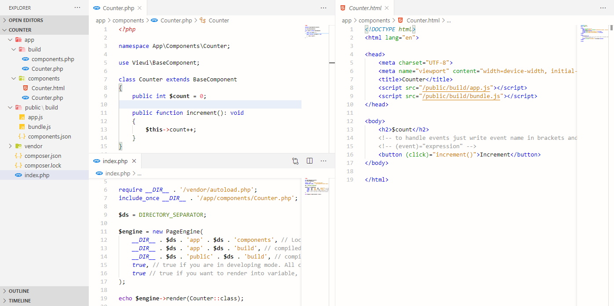

## Powerful tool for building full-stack and completely reactive user interfaces using PHP

Imagine Vue js or Angular but in PHP world with the similar user-friendly html templates and components, the application that acts like frontend framework and backend template engine at the same time and renders identical contents on both sides. And you don't even need Node js. Isn't it awesome?

### Stage: PoC

Not production ready yet, as it's in development and still needs a lot of work

#### *Requirements: php 7.4+*

Supported versions will be expanded  in the future

Get started
-----------

### Install Viewi

Run `composer require viewi/viewi:dev-master`

### Create folders for your components, templates build and public build for the browser. For example:

```
app
  |-components (for components and templates)
  |-build  (for compiled server's version, make sure it's writable)
public
  |-build (for browser's version, make sure it's publicly visible)
index.php
```

### Now let's create our fist component `Counter.php` and `Counter.html` in `app/components` folder.

Create `Counter` component by extending `BaseComponent`, this will tell Viewi to check html template as well. The name of template should be the same as component's file name.

```php
<?php

namespace App\Components\Counter;

use Viewi\BaseComponent;

class Counter extends BaseComponent
{
    public int $count = 0;

    public function increment(): void
    {
        $this->count++;
    }
}

```

Create `Counter.html` in the same folder and include javascript assets (`/public/build/app.js` and `/public/build/bundle.js`) to enable reactivity. Like this:

```html
<!DOCTYPE html>
<html lang="en">

<head>
    <meta charset="UTF-8">
    <meta name="viewport" content="width=device-width, initial-scale=1.0">
    <title>Counter</title>
    <script src="/public/build/app.js"></script>
    <script src="/public/build/bundle.js"></script>
</head>

<body>
    <h2>$count</h2>
    <!-- to handle events just write event name in brackets and expression to execute -->
    <!-- (event)="expression" -->
    <button (click)="increment()">Increment</button>
</body>

</html>
```

Now let's render our component. In your root `index.php` create instance of `PageEngine` and call `render` method with component name as an argument. For example:

```php
<?php

use App\Components\Counter;
use Viewi\PageEngine;

require __DIR__ . '/vendor/autoload.php';
include_once __DIR__ . '/app/components/Counter.php';

$ds = DIRECTORY_SEPARATOR;

$engine = new PageEngine(
    __DIR__ . $ds . 'app' . $ds . 'components', // Location of your's components
    __DIR__ . $ds . 'app' . $ds . 'build', // compiled server's version
    __DIR__ . $ds . 'public' . $ds . 'build', // compiled public assets (javascripts, etc.)
    true, // true if you are in developing mode. All components will be compiled as soon as request occures
    true // true if you want to render into variable, otherwise - echo output
);

echo $engine->render(Counter::class);

```

Final result should be looking like this:



And now just run `php -S localhost:8000` and open your browser at `http://localhost:8000/`. If everythink is good you should be able to click on the "Increment" button and count should be updated accordingly.

Features
----------------
- Server side rendering
- Perfect page load score
- Front end rendering
- Reactive application
- Easy to use
- Simple templates syntax, mix of HTML and PHP
- The same code for backend and frontend, without need to duplicate the logic in javascript.
- Web, mobile, desktop support (planned)
- Does not require Node js

## How does it work ?

Under the hood Viewi translates your entire view components into the javascript, and uses it for front end reactive application.

## Short documentation

[PageEngine](/doc/PageEngine.md)

## Tests

Got to `tests` folder
Run `php test.php backend`


License
--------

MIT License

Copyright (c) 2020-present Ivan Voitovych

Please see [LICENSE](/LICENSE) for license text


Legal
------

By submitting a Pull Request, you disavow any rights or claims to any changes submitted to the Viewi project and assign the copyright of those changes to Ivan Voitovych.

If you cannot or do not want to reassign those rights (your employment contract for your employer may not allow this), you should not submit a PR. Open an issue and someone else can do the work.

This is a legal way of saying "If you submit a PR to us, that code becomes ours". 99.9% of the time that's what you intend anyways; we hope it doesn't scare you away from contributing.
